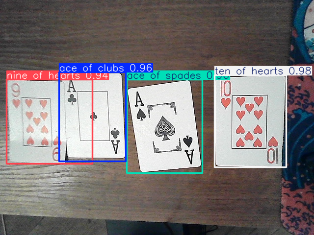
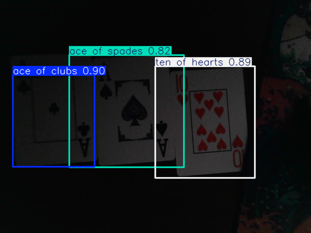

# 🃏 Blackjack Card Detection with YOLOv11, Faster R-CNN & RetinaNet

This project automates the detection of playing cards on a blackjack table using deep learning models. It includes training pipelines, inference scripts, dataset generation utilities, and a real-time camera demo. The system supports YOLOv11, Faster R-CNN, and RetinaNet models.

Special attention was given to dataset design: the images were collected and augmented in a way that enables the models to recognize cards on any table type, even when using low-resolution cameras, and under non-ideal lighting conditions. This allows for robust inference in real-world scenarios, such as casino environments or home gaming setups.

---

## 🔎 Visual Examples

### 🂡 Example: Detection of playing cards on a random table





---

## 📂 Project Structure
<pre lang="text">
BLACKJACK/
├── datasets/ # Raw and processed datasets
├── models/ # Pretrained and fine-tuned model weights
├── notebooks/ # Jupyter notebooks for visualization/testing
├── scripts/ # All training/inference/data tools
│ ├── dataset_prep/ # Dataset creation scripts
│ ├── inference/ # Inference & camera demo scripts
│ ├── training/ # Training scripts for all models
│ └── utils/ # Utility functions (dataset classes, evaluation, etc.)
├── cards.yaml # Class metadata for training
├── requirements.txt # Python dependencies
├── .gitignore # Files ignored by Git
└── README.md # Project documentation
 </pre>

---

## 🚀 Features

- 🔍 Card detection using:
  - ✅ YOLOv11
  - ✅ Faster R-CNN
  - ✅ RetinaNet
- 🛠 Custom dataset creation tools
- 📊 Evaluation utilities
- 🎥 Real-time detection with webcam
- 📦 Modular code structure for training and inference

---

Вот как правильно и красиво оформить этот блок для `README.md`, в соответствии с GitHub Markdown-стилем:

---

## 🛠 Installation

```bash
git clone https://github.com/your-username/blackjack-card-detector.git
cd blackjack-card-detector
```

### 🔹 Option 1: Using `venv` + `pip`

```bash
python -m venv venv
source venv/bin/activate        # On Windows: venv\Scripts\activate
pip install -r requirements.txt
```

### 🔹 Option 2: Using Conda and `environments.yml`

```bash
conda env create -f environments.yml
conda activate blackjack-env
```

---

## 🚀 Quick Start

### ▶️ Run inference on webcam

```bash
python scripts/inference/YOLOCardsCamera.py
```

### 🧠 Train YOLOv11

```bash
python scripts/training/retinatrain.py
```

### 🧰 Generate dataset

```bash
python scripts/dataset_prep/generatedataset.py
```

---

📈 Dataset Format

    Based on YOLO format (one .txt file per .jpg image)

    Dataset is split into: train/, val/, test/

    Class list defined in cards.yaml

🧠 Models

    fine_tuned_yolo11.pt: YOLOv11 fine-tuned on playing card images

    FasterRCNNModel.pth: custom trained Faster R-CNN weights

    retinanet_cards.pth: RetinaNet trained for card detection

🤖 Dependencies

All required packages are listed in requirements.txt. Main ones:

    ultralytics

    torch, torchvision

    opencv-python

    matplotlib

📄 License

MIT License. Use freely, but attribution is appreciated.